# System
* Current OS: Darwin

* simuexe path: build/bin/simuapp

## Function

# SPE4-b

### Load STARS

### Load ECL

### Load SMY File

        61 116.4600  1   3650.000     0.07             27.29             99.73                      29.97   43.162   0.0208   0.0020   3.4502
    
    ============================================================
                    WALL-TIME PERFORMANCE REPORT                
    ============================================================
    Category                              Total Time   % Total
    ------------------------------------------------------------
    Timeloop                                  1.365s    89.04%
    |- Newton                                 1.285s    94.17%
      |- Jacobian                             0.833s    64.84%
      |- Update                               0.323s    25.14%
      |- Solver                               0.111s     8.64%
      |- Residual                             0.007s     0.57%
      |- Logging                              0.003s     0.20%
    |- Output                                 0.076s     5.58%
    |- Input                                  0.000s     0.00%
    Initialization                            0.168s    10.96%
    ------------------------------------------------------------
    TOTAL                                     1.533s
    ============================================================
    
    
## Select and Plot Columns
Select specific columns from the loaded DataFrames and plot them using matplotlib. For example, plot `TIME` vs `TEMP 1-1-4` from `stars_spe4b_special.csv`.

### Cell property

#### Block Pressure
    
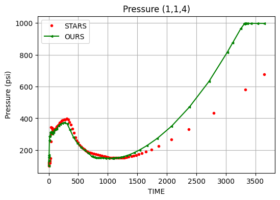
    

    

    

    
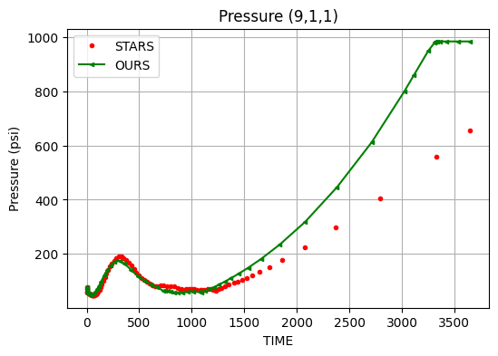
    

#### Block Temperature

    

    

    
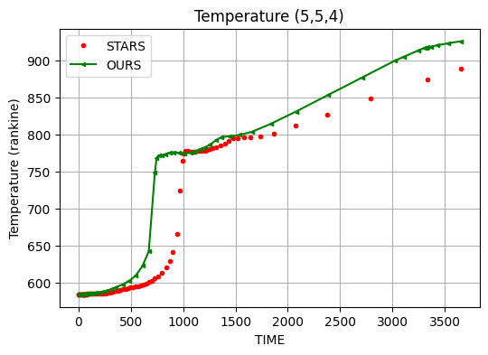
    

    

    

#### Block Saturation

    
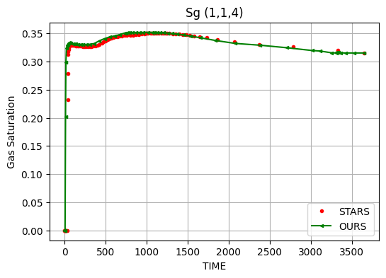
    

    

    

    

    

    

    

    

    

    

    

### vesus ECL

    
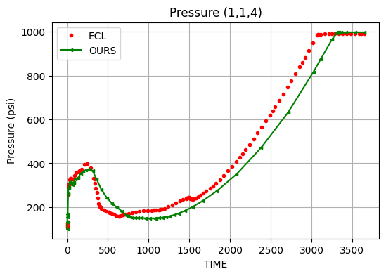
    

    

    

    

    

    

    

    

    

    

    

    
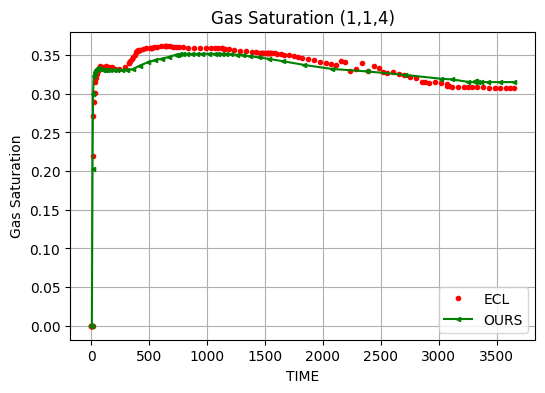
    

    

    

    

    

    

    

    
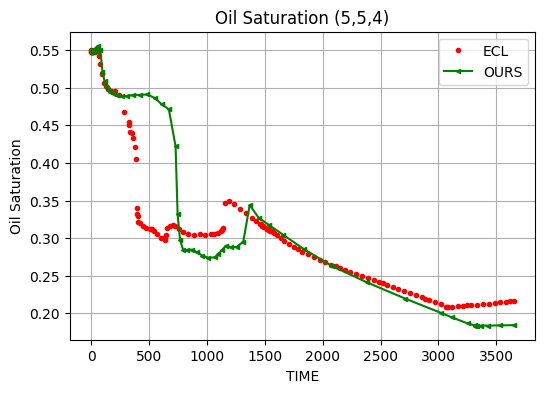
    

    

    

### Well property

#### Injector

    

    

    

    

#### Producer Corner

    

    

    

    

    

    

#### Producer Edge

    

    

    

    

    
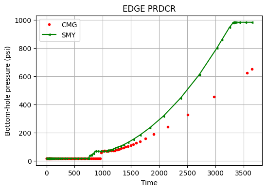
    

# 3D

# Buckley- Leverett

    
    =========================================================================================================================================
    ------Time Step----- --Time-- -----------------Production----------------- ---------Injection-------- --mat--- ------Maximum Changes-----
                       C             Oil     Gas      Water    GOR      Wat.      Oil      Gas    Water     bal      Pres     Sat     Temp   
            Size       U                                       ft3      Cut                                 err                              
     No      day    IT T   day      bbl/d    ft3/d    bbl/d    /bbl      %      bbl/d    ft3/d    bbl/d      %        psi              degF  
    ------ -------- -- - -------- -------- -------- -------- -------- -------- -------- -------- -------- -------- -------- -------- --------
         1 2.33e-04 12 1  2.3e-04     1.00                                                           1.00    0.045 491.1717   0.3331   0.1833
         2 1.27e-04  2    3.6e-04     1.00                                                           1.00    0.049   4.2661   0.0849   0.0202
         3 1.90e-04  4    5.5e-04     1.00                                                           1.00    0.842   7.5636   0.1334   0.0236
         4 2.34e-04  6    7.8e-04     1.00                                                           1.00    1.764   8.8050   0.1361   0.0221
         5 2.87e-04  6      0.001     1.00                                                           1.00    2.652  10.9567   0.1361   0.0213
         6 3.51e-04  8      0.001     1.00                                                           1.00    3.573  13.3953   0.1495   0.0213
         7 4.10e-04  8      0.002     1.00                                                           1.00    4.521  15.2025   0.1385   0.0215
         8 4.97e-04  9      0.002     1.00                                                           1.00    5.403  18.1014   0.1466   0.0223
         9 5.87e-04 12      0.003     1.00                                                           1.00    6.285  21.5336   0.1617   0.0226
        10 5.87e-04 13      0.004     1.00                                                           1.00    7.184  20.8806   0.1476   0.0212
        11 5.42e-04 10      0.004     1.00                                                           1.00    8.009  18.1082   0.1245   0.0195
        12 6.50e-04  9      0.005     0.93              0.09              8.70                       1.00    8.572  21.0769   0.1451   0.0215
        13 7.71e-04  3      0.005     0.60              0.40             39.88                       1.00    9.202  33.8326   0.1169   0.0384
        14 1.01e-03  2      0.006     0.36              0.64             64.32                       1.00    9.553  38.7342   0.0710   0.0431
        15 1.60e-03  2      0.008     0.22              0.78             78.07                       1.00    9.498  37.2375   0.0511   0.0461
        16 2.79e-03  2      0.011     0.13              0.87             86.65                       1.00    9.010  36.8735   0.0441   0.0501
        17 5.02e-03  2      0.016     0.08              0.92             92.25                       1.00    8.001  34.6674   0.0415   0.0503
        18 9.18e-03  3      0.025     0.04              0.96             95.80                       1.00    6.599  30.4609   0.0401   0.0463
        19   0.0169  2      0.042     0.02              0.98             97.91                       1.00    4.666  24.6086   0.0377   0.0396
        20   0.0315  3      0.073     0.01              0.99             99.04                       1.00    2.763  18.7093   0.0330   0.0362
        21   0.0603  3      0.134     0.00              1.00             99.60                       1.00    1.145  13.6037   0.0270   0.0109
        22   0.1192  3      0.253     0.00              1.00             99.85                       1.00    0.317   9.2554   0.0200   0.0062
        23   0.2454  3      0.498    6e-04              1.00             99.94                       1.00    0.239   7.2956   0.0190   0.0026
        24   0.5082  1      1.007    1e-04              1.00             99.99                       1.00    9.205   3.0877   0.0130 8.97e-04
        25   1.0913  1      2.098    1e-05              1.00            100.00                       1.00   11.017   0.5423   0.0040 2.62e-04
        26   2.4803  1      4.578    4e-07              1.00            100.00                       1.00   10.757   0.0440 4.28e-04 5.35e-05
        27   5.4217  1     10.000                       1.00            100.00                       1.00    9.014 1.41e-04 1.52e-05 9.27e-06
    
    ============================================================
                    WALL-TIME PERFORMANCE REPORT                
    ============================================================
    Category                              Total Time   % Total
    ------------------------------------------------------------
    Timeloop                                  0.378s    85.88%
    |- Newton                                 0.344s    90.95%
      |- Jacobian                             0.196s    56.95%
      |- Update                               0.109s    31.72%
      |- Solver                               0.031s     8.98%
      |- Residual                             0.003s     0.96%
      |- Logging                              0.001s     0.37%
    |- Output                                 0.033s     8.76%
    |- Input                                  0.000s     0.00%
    Initialization                            0.062s    14.12%
    ------------------------------------------------------------
    TOTAL                                     0.440s
    ============================================================
    
    

### Load Benchmark

### Buckley Plot

    

    

    
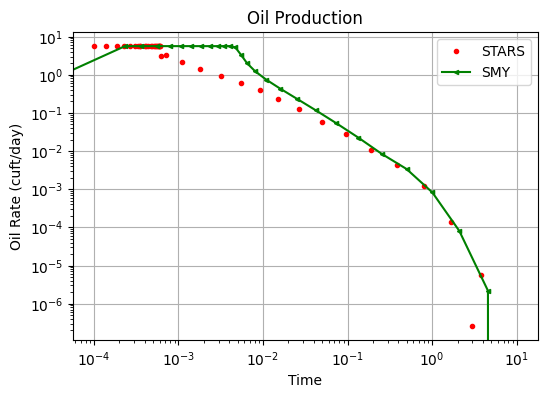
    

# MISC

    /Users/mark/Documents/workspace/hatch/app/build/test/data/spe04b_cw.dat
    
        22 365.0000  1   3650.000     5.00             63.84             92.74                      67.50    0.352   4.5892   0.0301   0.0084
    
    ============================================================
                    WALL-TIME PERFORMANCE REPORT                
    ============================================================
    Category                              Total Time   % Total
    ------------------------------------------------------------
    Timeloop                                  0.657s    90.89%
    |- Newton                                 0.575s    87.56%
      |- Jacobian                             0.360s    62.57%
      |- Update                               0.185s    32.18%
      |- Solver                               0.023s     4.02%
      |- Residual                             0.004s     0.62%
      |- Logging                              0.000s     0.09%
    |- Output                                 0.081s    12.27%
    |- Input                                  0.000s     0.00%
    Initialization                            0.066s     9.11%
    ------------------------------------------------------------
    TOTAL                                     0.723s
    ============================================================
    
    

    /Users/mark/Documents/workspace/hatch/app/build/test/data/watfld_cw.dat
    
        38 145.2021  1   3650.000     6.59            496.77             98.69                     503.18    2.007   1.1454   0.0125 3.79e-05
    
    ============================================================
                    WALL-TIME PERFORMANCE REPORT                
    ============================================================
    Category                              Total Time   % Total
    ------------------------------------------------------------
    Timeloop                                  0.879s    91.77%
    |- Newton                                 0.741s    84.30%
      |- Jacobian                             0.446s    60.25%
      |- Update                               0.250s    33.69%
      |- Solver                               0.035s     4.73%
      |- Residual                             0.005s     0.68%
      |- Logging                              0.001s     0.09%
    |- Output                                 0.136s    15.44%
    |- Input                                  0.000s     0.00%
    Initialization                            0.079s     8.23%
    ------------------------------------------------------------
    TOTAL                                     0.957s
    ============================================================
    
    

    /Users/mark/Documents/workspace/hatch/app/build/test/data/stflu001.dat
    
       172 348.4941  6   3650.000   103.23            781.38             88.33                     877.97   98.744   2.0596   0.0450   0.8750
    
    ============================================================
                    WALL-TIME PERFORMANCE REPORT                
    ============================================================
    Category                              Total Time   % Total
    ------------------------------------------------------------
    Timeloop                                  2.243s    97.38%
    |- Newton                                 2.042s    91.06%
      |- Jacobian                             1.399s    68.51%
      |- Update                               0.558s    27.33%
      |- Solver                               0.057s     2.77%
      |- Residual                             0.012s     0.58%
      |- Logging                              0.004s     0.21%
    |- Output                                 0.194s     8.64%
    |- Input                                  0.000s     0.00%
    Initialization                            0.060s     2.62%
    ------------------------------------------------------------
    TOTAL                                     2.303s
    ============================================================
    
    

    /Users/mark/Documents/workspace/hatch/app/build/test/data/stflu002.dat
    
        50  84.4287  1   3650.000  3931.85             69.77              1.74                    3998.28    6.178  40.9010   0.0127   0.0124
    
    ============================================================
                    WALL-TIME PERFORMANCE REPORT                
    ============================================================
    Category                              Total Time   % Total
    ------------------------------------------------------------
    Timeloop                                  0.605s    90.72%
    |- Newton                                 0.554s    91.66%
      |- Jacobian                             0.341s    61.58%
      |- Update                               0.151s    27.33%
      |- Solver                               0.052s     9.40%
      |- Residual                             0.004s     0.74%
      |- Logging                              0.001s     0.25%
    |- Output                                 0.047s     7.84%
    |- Input                                  0.000s     0.01%
    Initialization                            0.062s     9.28%
    ------------------------------------------------------------
    TOTAL                                     0.667s
    ============================================================
    
    

# SPE4C

## Run & Load

    /Users/mark/Documents/workspace/hatch/app/build/test/data/stspe003.dat
    
       182   1.3848  6 2 3149.019     0.11             33.31             99.66                       1.74   41.017   3.7967   0.1005   1.9011
       183   1.9347  2   3150.953     0.11             17.39             99.39                      31.55   41.021   1.8556   0.0139   0.2522
       184   4.1326  2   3155.086     0.10             17.60             99.41                      31.54   41.011   0.0576   0.0161   0.3477
       185   8.7058  2   3163.792     0.10             20.78             99.52                      31.54   40.998   0.1570   0.0155   0.6498
       186  18.4128  2   3182.205     0.09             23.27             99.60                      31.49   40.979   0.1249   0.0335   1.1251
       187  35.1133  2   3217.318     0.08             25.83             99.68                      31.05   40.999   0.1478   0.0225   1.6442
       188  71.2297  2   3288.548     0.07             28.34             99.77                      30.48   41.057   0.1765   0.0060   3.2002
       189 153.1344  3   3441.682     0.04             28.32             99.84                      28.65   41.193   0.5585   0.0091   6.4381
       190 208.3181  3   3650.000     0.03             27.22             99.89                      27.02   42.160   0.5504   0.0075   6.9417
    
    ============================================================
                    WALL-TIME PERFORMANCE REPORT                
    ============================================================
    Category                              Total Time   % Total
    ------------------------------------------------------------
    Timeloop                                 11.290s    99.39%
    |- Newton                                11.026s    97.66%
      |- Jacobian                             7.283s    66.05%
      |- Update                               1.909s    17.32%
      |- Solver                               1.741s    15.79%
      |- Residual                             0.035s     0.32%
      |- Logging                              0.015s     0.14%
    |- Output                                 0.251s     2.23%
    |- Input                                  0.000s     0.00%
    Initialization                            0.070s     0.61%
    ------------------------------------------------------------
    TOTAL                                    11.359s
    ============================================================
    
    

#### Load CMG

### Load ECL

### Wells

    

    

    
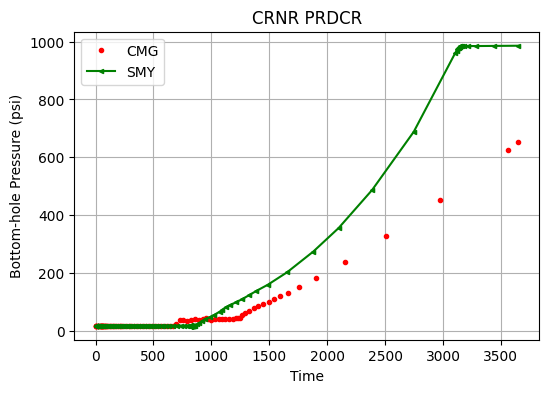
    

    

    

    

    

    

    

    
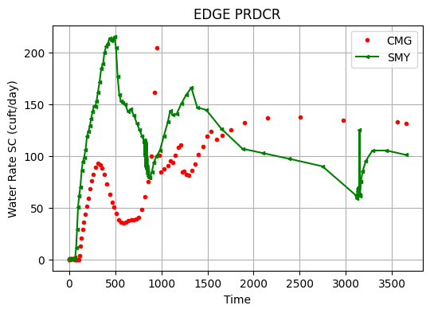
    

    

    

### Block
#### Block Pressure

    
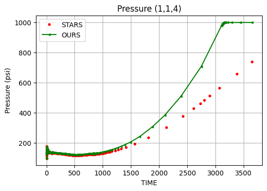
    

    
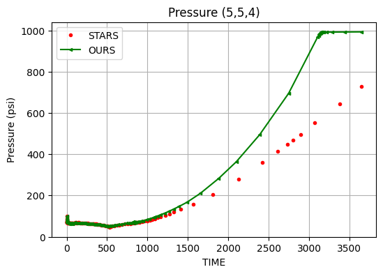
    

    

    

#### Block Temperature

    
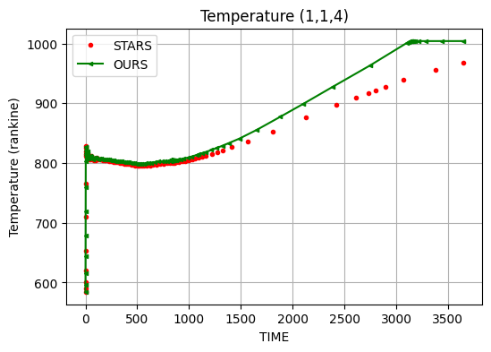
    

    
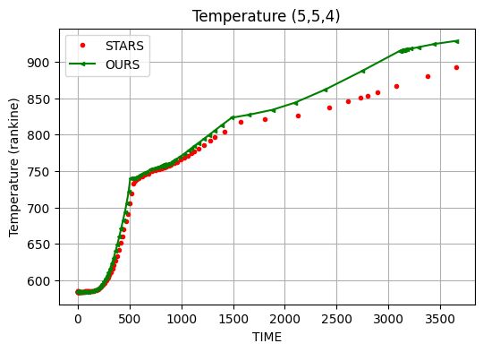
    

    

    

    

    

    
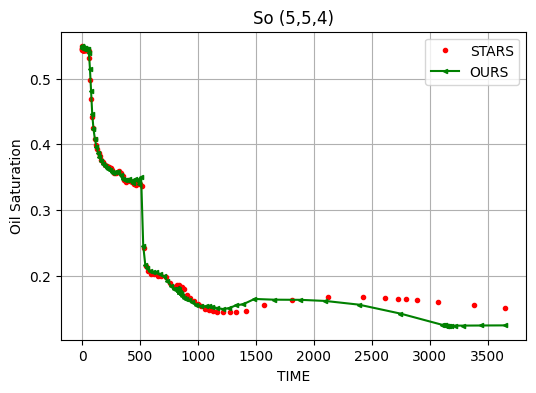
    

    

    

    

    

    

    

    
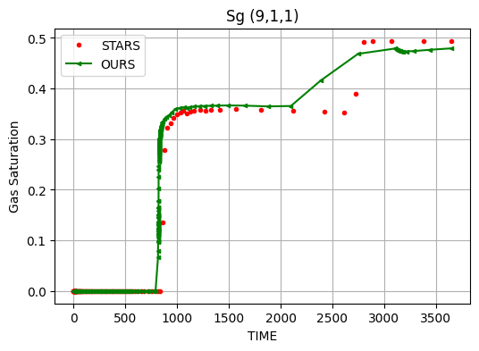
    

#### v.s. ECL

    

    

    
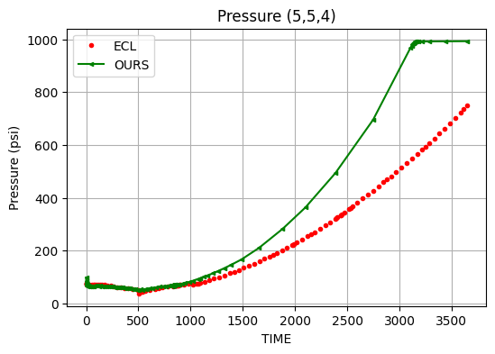
    

    

    

